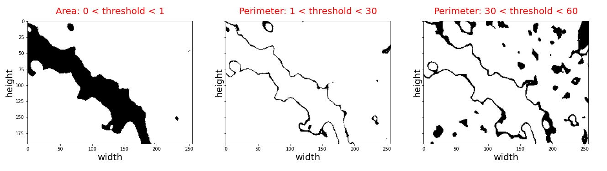

# 2. Methods:

## 2.1 Exploratory Data Analysis 

Exploratory data analysis (EDA) is an important step conducted on any data analysis project for identification, characterization, and quantifiaction of different features. In this project, our input data consists of two columns, images (IDs) and their corresponding porosity, which were determined by ImageJ commercial software. Fig 1 shows porosities of five random images for each batch, with porosities variable from 0 to 100 percent.

    Figure 1: importing tabular data for EDA

The data set has two batches and each batch has 100 images, which will be used for porosity characterization. In the next step, images are read to facilitate understanding of the general characterestics of pore system. The first three images chosen from batch1 are shown in Fig 2:
               

    Figure 2: importing first three images from batch1

As shown in Fig 2, images were shown in Viridis color system. However, there are two problems associate with the Viridis color system used for reading images. Firstly, there is a significant variation of color for thresholds ranging from 0 to 10, hence porosity quantification may subject to instability. Secondly, identifiaction and quantification of cement hydration products has been done in Greyscale color system [1]. Consequently, it is required to convert Viridis to Greyscale color system to enahnce accuracy of EDA. Fig 3 provides a comparison of these two different color systems

    Figure 3: comparison of Viridis vs. Greyscale color systems for reading images in python 

As previously mentioned, the color system of images had to be converted to Greyscale to faciliate chemical analysis of hydartes, and ease  quantification of porosity in cement paste matrix. In Fig 4, it is shown that pixels having darker luminance belong to capillary pores, intermediate thresholds belong to hydrated products, while higher thresholds belongs to cement hydarted products. 

    Figure 4: identifiaction and quantification of different phases using greyscale SEM images
    
As a result, Fig 5 shows a converted version of Fig 1 transformed from Viridis to Greyscale, which will be used for EDA.  

   

    Figure 5: transformation of input images from Viridis to Greyscale  
    
## 2.2 Model Caliberation
    
To quntify porosity and other characterestics of images, including chemistry and angularity of pores, it is a required task to caliberate the model. The input grayscale images are all having 256*196 pixels with grayscale thresholds ranging from 0 to 255; dark pixels represent pores, while pixels with higher thershold values represent cement hydrated or anhydrous products. To quantify pore volume fraction, different thresholds correspond to pores are chosen to determine the impact of threshold limit on the averge porosity (see Fig 6). Fig 6 illuminates the maximum thresholds for both batches (i.e. 14 and 9 for batches 1 and 2, respectively), which avoids overestimation of porosity in both batches. Almost 400 million pixels were analyzed to generate this figure.

  

    Figure 6: quantification of average porosity vs. threshold limits

Figs 7 and 8 represent the important role of assigning a correct threshold value for characterizing porosity. In other words, increasing the luminance (threshold) of images from a certain limit (i.e. i.e. 14 and 9 for batches 1 and 2, respectively) will result in the inclusion of dark hydration products (i.e. precialse or luminance), which has to be avoide. 
    
    

    Figure 7: dependence of batch1 porosity on the assigned luminance 

 

    Figure 8: dependence of batch1 porosity on the assigned luminance

Therefore, luminance of images should be assigned carefully to realistically estimate porosity with minimum error. Fig 9 further illuminates dependence of image analysis on the assigned threshold. In this figure, the exact porosities of images found from ImageJ software are comapred with those estimated using EDA for both two batches. This comparison reveals that as long as the luminance is limited to 10, calculated porosities remain stable and accurate, while exceeding this limits results in over estimatetion of porosites. 
    
 

    Figure 9: matching estimated porosities with exact porosities for different threshold limits

Considering Fig 9, the threshold limit = 0 is finally chosen to accurately estimate the porosity of images. 

## 2.3 Chemical Analysis

As previously mentioned, greyscale SEM images are required to be considered for chemical analysis. The following thresholds intervals are defined for each image to characterize different phases:

* Capillary Pores: 0 < threshold < 1
* Magnesium/ Sulphur: 10 < threshold < 70
* Calcium Silicate Hydrates (C-S-H): 70 < threshold < 140
* Calcium Hydroxide (C-H): 140 < threshold < 180
* Unknown (Anhydrous/ Aluminum): 180 < threshold < 255

To determine the robustness of image-based chemical analysis, a random image from batch1 is selected and characterized in Fig 10.

 

    Figure 10: chemical analysis of greyscale SEM images
    
## 2.4 Angularity of Capillary Pores

In the next step, the shape of capillary pores is characterized using a terminology called angularity. For this purpose, a dimensionless formula is defined to calculate angularity based on the total perimeter and area of capillary pores of each figure:

 

As shown in the Fig 11, for capillary pores having similar area, the perimeter increases with angularity. In other words, pores having similar perimeter but less angularity have larger areas.

 

    Figure 11: comparing round vs angular shapes
    
Accordingly, it is required to calculate area and perimeter of capillary pores in each figure. Based on trial and error attempts, the threshold interval for calculating area of pores is 0 < threshold < 1, while to estimate perimeter, the interval is modified to 1 < threshold < 30. Also, incorporating higher threshold limits (i.e. 30 < threshold < 60) would include hydrates having relatively darker luminance, e.g. magnesium or brucite, that may result in overestimation of porosity. Fig 12 shows estimation of total area as well as total porosity, as a function of luminance interval, for estimating angularity of each image.

 

    Figure 12: estimating parameters of angularity 
    
    
## 2.5 Modeling

The ANN models shown below explain how cement chemistry (model I) together with a combination of cement chemistry and pore physical shape (model II) could be used to estimate porosities, i.e. output, of testing batch 3 (Fig 13).

 

    Figure 13: ANN models used for estimating porosities

The first step for doing ANN is to determine the type of variables used for training the datasets. As shown in Fig 14, the variables shown are all in float 64 type. However, only float32 datatype works well for tensor flow, and the variables are hence converted to this datatype. 

 

    Figure 14: Representing the type of input variables
    
The structure of employed ANN model consists of layers having different complexities, which are placed sequentially. As well, 1024 intermediate nodes are generated by matrix multiplications using ReLU rectifier to facilitate prediction of the nonlinear model, see Fig 15. To control the speed and quality of learning process, the value of other hyperparameters including, learning rate, epochs, and batch size are set to be 0.0001, 300, and 50, respectively.  

 

    Figure 15: Creating ANN model to estimate porosities

A model has been built using Convolutional Neural Network (CNN) approach. Having the images from the training set coincided with their labels (porosity values) as the input of the model. This model will be freezed while fetching and processing a previous model performed on a very big data (images). The usual image data set “imagenet” is used as a preprocessed model to let the model train in a complex way to understand and identify images.
Due to having a very limited number of images, we had to divide porosity into categories in order to make it easier to the model to predict for a limited number of outputs (labels). This division was done by some of the team members as a way of variety in this project. However, in any real case study, specifing categories will be needed to make it more reasonable to predict physiochemical properties such as freezing and thawing since freezing and thawing behavior for example is changing discretely e.g: very poor, poor, acceptable, good, very good.

Image augmentation is pretty important in image processing. As we deal with pixels values and shapes, we focused on image flipping and sizing augmentation rather than color augmentation since we deal with grayscale images and pixels values.

Regarding the model, it was not different from what was given in the class. Manipulation of hyperparameters was critical in order to achieve a satisfactory accuracy. Fig 16 shows the model and Fig 17 shows the used hyperparameters in the CNN model. The used epochs is 80, and learning rate is 5.0 e-5.

 

    Figure 16: the CNN model algorithm 
 
    
    Figure 17: hyperparameters for CNN model

