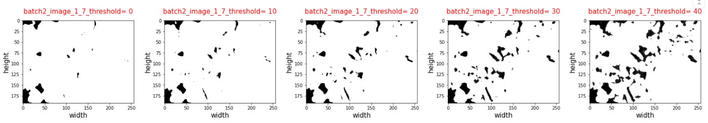
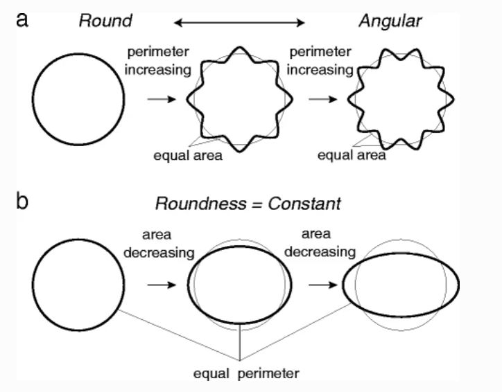
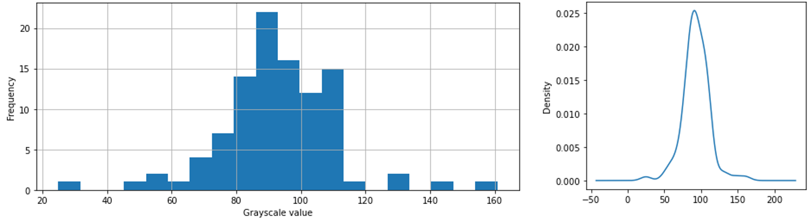
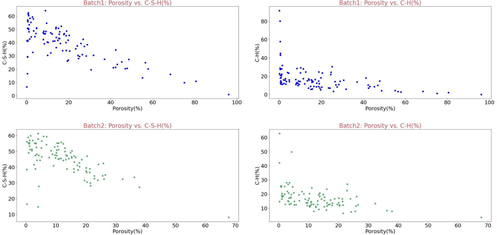
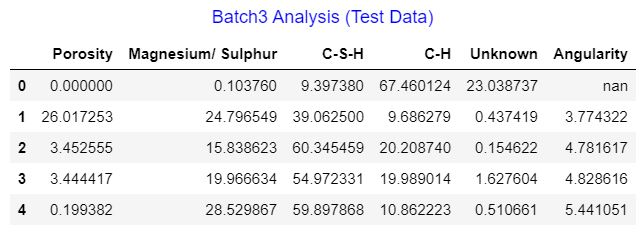
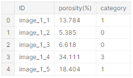
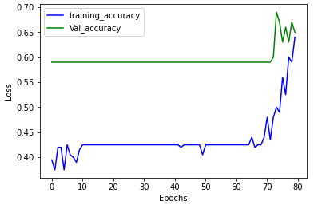
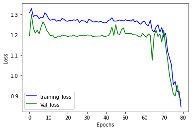

---
author-meta: []
bibliography: []
date-meta: '2020-12-08'
header-includes: '<!--

  Manubot generated metadata rendered from header-includes-template.html.

  Suggest improvements at https://github.com/manubot/manubot/blob/master/manubot/process/header-includes-template.html

  -->

  <meta name="dc.format" content="text/html" />

  <meta name="dc.date" content="2020-12-08" />

  <meta name="citation_publication_date" content="2020-12-08" />

  <meta name="dc.relation.ispartof" content="Manubot" />

  <meta name="dc.publisher" content="Manubot" />

  <meta name="citation_journal_title" content="Manubot" />

  <meta name="citation_technical_report_institution" content="Manubot" />

  <link rel="canonical" href="https://hosseinkabiruiuc.github.io/group8/" />

  <meta property="og:url" content="https://hosseinkabiruiuc.github.io/group8/" />

  <meta property="twitter:url" content="https://hosseinkabiruiuc.github.io/group8/" />

  <meta name="citation_fulltext_html_url" content="https://hosseinkabiruiuc.github.io/group8/" />

  <meta name="citation_pdf_url" content="https://hosseinkabiruiuc.github.io/group8/manuscript.pdf" />

  <link rel="alternate" type="application/pdf" href="https://hosseinkabiruiuc.github.io/group8/manuscript.pdf" />

  <link rel="alternate" type="text/html" href="https://hosseinkabiruiuc.github.io/group8/v/acc26fc2c4f13865d809ab66d9d8fa42ba1b4c82/" />

  <meta name="manubot_html_url_versioned" content="https://hosseinkabiruiuc.github.io/group8/v/acc26fc2c4f13865d809ab66d9d8fa42ba1b4c82/" />

  <meta name="manubot_pdf_url_versioned" content="https://hosseinkabiruiuc.github.io/group8/v/acc26fc2c4f13865d809ab66d9d8fa42ba1b4c82/manuscript.pdf" />

  <meta property="og:type" content="article" />

  <meta property="twitter:card" content="summary_large_image" />

  <link rel="icon" type="image/png" sizes="192x192" href="https://manubot.org/favicon-192x192.png" />

  <link rel="mask-icon" href="https://manubot.org/safari-pinned-tab.svg" color="#ad1457" />

  <meta name="theme-color" content="#ad1457" />

  <!-- end Manubot generated metadata -->'
manubot-clear-requests-cache: false
manubot-output-bibliography: output/references.json
manubot-output-citekeys: output/citations.tsv
manubot-requests-cache-path: ci/cache/requests-cache
...

<small><em>
This manuscript
([permalink](https://hosseinkabiruiuc.github.io/group8/v/acc26fc2c4f13865d809ab66d9d8fa42ba1b4c82/))
was automatically generated
from [hosseinkabiruiuc/group8@acc26fc](https://github.com/hosseinkabiruiuc/group8/tree/acc26fc2c4f13865d809ab66d9d8fa42ba1b4c82)
on December 8, 2020.
</em></small>

## Authors

# CEE 498 Project: Characterization of Porosity in Cement Paste Matrix

### Faisal Qadri, PhD Student, Construction Materials Group, University of Illinois

### Hossein Kabir, PhD Student, Construction Materials Group, University of Illinois

### Tianshu Xiao, MS Student, Construction Management, University of Illinois

# Abstract

This research investigates applicability of image-based analysis to quantify and classify porosities in grayscale scanning electron microscopy (SEM) images, made from polished thin section of hydrated cement beams. Within the past decades, mercury intrusion porosimeter (MIP) technique has been used to measure pore volume fraction in cement-based matrices. However, MIP method was found to overestimate porosity as it is incapable of quantifying disconnected pores. Therefore, it is of interest to determine whether image analysis coupled with Artificial Neural Network (ANN) or Convolutional Neural Network (CNN) could characterize porosity. Accordingly, images pre-analyzed by ImageJ commercial software are used to calibrate the python code. The calibrated model was used for Exploratory Data Analysis (EDA) for feature engineering. The extracted features, which are likely to be predictive of porosity, are used to train the employed machine learning models. Results of the present study revealed the applicability of ANN for estimating porosity based on physical properties of pores and chemistry of hydrates. Also, CNN is found to be an efficient way of classifying SEM images having different pore volume fraction. The present research has the potential to be used in future to predict the remaining service life and the physicochemical properties of the cement matrix.

## Keywords: 
Scanning Electron Microscopy (SEM), Mercury Intrusion Porosimeter (MIP), Artificial Neural Network (ANN), Convolutional Neural Network (CNN), Exploratory Data Analysis (EDA), porosity

# 1. Introduction

 Durability of concrete structures against gradual ingress of deleterious liquids is mainly controlled by porosity and pore structure of cement paste matrix [1]. Pore structure is mainly divided into two main categories: capillary and gel pores and they range from few millimeters into few nano-meters having 70-90% of total porosity in the nano scale. There are multiple factors that affect general properties of capillary pore structure in concrete, which include curing regimes, cementitious materials contents, and water-to-cementitious materials ratios [1-2]. Therefore, it is necessary to precisely measure and characterize pore structure in concrete to determine the optimum concrete curing conditions and mix proportions. 
 
 Over the past few decades, mercury intrusion porosimeter (MIP) test has been used to measure porosity and pore size distribution in cement-based composites. In this method, using relatively high pressure, mercury is injected into the pore spaces of the matrix to determine porosity and its structure. MIP test, with an ability to measure pore sizes in the range of 0.006–500 µm, is typically performed on a small oven-dried cement-composite specimen and mercury is gradually applied on the desired surface [1]. However, it has been reported that, cement matrix surface tension as well as mercury contact angle with cement pore wall affects the accuracy of MIP measurements [3]. Moreover, MIP needs speciemn preparation; it is hard to conduct; and it is deemed a destructive test in such it damages weak microstructure due to the applied high pressure.

To address the uncertainty of MIP results, image analysis method is recently developed to directly measure paste matrix porosity. Backscattered scanning electron microscopy (SEM) images of polished impregnated epoxy concrete surface is captured and analyzed using ImageJ commercial software [1]. To go further, ImageJ software quantifies the total area of pores using a grayscale thresholded image. However, this commercial software solely provides total porosity of the matrix and lacks the ability to characterize porosity [1]. In addition, comparing the total porosity of paste matrices measured by MIP method with that measured by ImageJ revealed that porosity is underestimated in the former technique. In fact, in contrary to MIP, Image analysis is capable of measuring both connected and disconnected capillary pores, and hence gives a more realistic picture of the paste matrix pore system [1]. Also, SEM technique is easy to conduct since it does not need and specimen preparation, but costs a lot of money.

As a result, it is required to develop an image analysis-based technique to not only determine total porosity, but also characterize the pore structure, such as shape, size, and angularity of the pore system. For this reason, robust codes are written in python to read and analyze greyscale thresholded 200 SEM images. The present analysis is calibrated by matching average porosity found by python-based image analysis with that of ImageJ software. The calibrated model is then used to read images to find pore size distribution of the matrix. In the next step, chemistry of hydrates and angularity of pores are estimated to be used as features for the employed machine learning algorithms. Results of the present analysis revealed that ANN is a robust technique being capable of correlating pore volume fraction with angularity of pores, as well as chemistry of hydrates. In addition, porosities are classified into different categories using an optimized CNN. The relatively low Root Mean Squared Error (RSME) values of the two machine learning techniques, i.e. ANN and CNN, proposes the robustness of the present methodology over MIP for characterizing porosity in cement paste matrix. 

# 2. Methods:

## 2.1 Exploratory Data Analysis 

Exploratory data analysis (EDA) is an important step conducted on any data analysis project for identification, characterization, and quantifiaction of different features. In this project, our input data consists of two columns, images (IDs) and their corresponding porosity, which were determined by ImageJ commercial software. Fig 1 shows porosities of five random images for each batch, with porosities variable from 0 to 100 percent.

    Figure 1: importing tabular data for EDA

The data set has two batches and each batch has 100 images, which will be used for porosity characterization. In the next step, images are read to facilitate understanding of the general characterestics of pore system. The first three images chosen from batch1 are shown in Fig 2:
               

    Figure 2: importing first three images from batch1

As shown in Fig 2, images were shown in Viridis color system. However, there are two problems associate with the Viridis color system used for reading images. Firstly, there is a significant variation of color for thresholds ranging from 0 to 10, hence porosity quantification may subject to instability. Secondly, identifiaction and quantification of cement hydration products has been done in Greyscale color system [1]. Consequently, it is required to convert Viridis to Greyscale color system to enahnce accuracy of EDA. Fig 3 provides a comparison of these two different color systems

    Figure 3: comparison of Viridis vs. Greyscale color systems for reading images in python 

As previously mentioned, the color system of images had to be converted to Greyscale to faciliate chemical analysis of hydartes, and ease  quantification of porosity in cement paste matrix. In Fig 4, it is shown that pixels having darker luminance belong to capillary pores, intermediate thresholds belong to hydrated products, while higher thresholds belongs to cement hydarted products. 

    Figure 4: identifiaction and quantification of different phases using greyscale SEM images
    
As a result, Fig 5 shows a converted version of Fig 1 transformed from Viridis to Greyscale, which will be used for EDA.  

   

    Figure 5: transformation of input images from Viridis to Greyscale  
    
## 2.2 Model Caliberation
    
To quntify porosity and other characterestics of images, including chemistry and angularity of pores, it is a required task to caliberate the model. The input grayscale images are all having 256*196 pixels with grayscale thresholds ranging from 0 to 255; dark pixels represent pores, while pixels with higher thershold values represent cement hydrated or anhydrous products. To quantify pore volume fraction, different thresholds correspond to pores are chosen to determine the impact of threshold limit on the averge porosity (see Fig 6). Fig 6 illuminates the maximum thresholds for both batches (i.e. 14 and 9 for batches 1 and 2, respectively), which avoids overestimation of porosity in both batches. Almost 400 million pixels were analyzed to generate this figure.

  

    Figure 6: quantification of average porosity vs. threshold limits

Figs 7 and 8 represent the important role of assigning a correct threshold value for characterizing porosity. In other words, increasing the luminance (threshold) of images from a certain limit (i.e. i.e. 14 and 9 for batches 1 and 2, respectively) will result in the inclusion of dark hydration products (i.e. precialse or luminance), which has to be avoide. 
    
    

    Figure 7: dependence of batch1 porosity on the assigned luminance 

 

    Figure 8: dependence of batch1 porosity on the assigned luminance

Therefore, luminance of images should be assigned carefully to realistically estimate porosity with minimum error. Fig 9 further illuminates dependence of image analysis on the assigned threshold. In this figure, the exact porosities of images found from ImageJ software are comapred with those estimated using EDA for both two batches. This comparison reveals that as long as the luminance is limited to 10, calculated porosities remain stable and accurate, while exceeding this limits results in over estimatetion of porosites. 
    
 

    Figure 9: matching estimated porosities with exact porosities for different threshold limits

Considering Fig 9, the threshold limit = 0 is finally chosen to accurately estimate the porosity of images. 

## 2.3 Chemical Analysis

As previously mentioned, greyscale SEM images are required to be considered for chemical analysis. The following thresholds intervals are defined for each image to characterize different phases:

* Capillary Pores: 0 < threshold < 1
* Magnesium/ Sulphur: 10 < threshold < 70
* Calcium Silicate Hydrates (C-S-H): 70 < threshold < 140
* Calcium Hydroxide (C-H): 140 < threshold < 180
* Unknown (Anhydrous/ Aluminum): 180 < threshold < 255

To determine the robustness of image-based chemical analysis, a random image from batch1 is selected and characterized in Fig 10.

 

    Figure 10: chemical analysis of greyscale SEM images
    
## 2.4 Angularity of Capillary Pores

In the next step, the shape of capillary pores is characterized using a terminology called angularity. For this purpose, a dimensionless formula is defined to calculate angularity based on the total perimeter and area of capillary pores of each figure:

 

As shown in the Fig 11, for capillary pores having similar area, the perimeter increases with angularity. In other words, pores having similar perimeter but less angularity have larger areas.

 

    Figure 11: comparing round vs angular shapes
    
Accordingly, it is required to calculate area and perimeter of capillary pores in each figure. Based on trial and error attempts, the threshold interval for calculating area of pores is 0 < threshold < 1, while to estimate perimeter, the interval is modified to 1 < threshold < 30. Also, incorporating higher threshold limits (i.e. 30 < threshold < 60) would include hydrates having relatively darker luminance, e.g. magnesium or brucite, that may result in overestimation of porosity. Fig 12 shows estimation of total area as well as total porosity, as a function of luminance interval, for estimating angularity of each image.

 

    Figure 12: estimating parameters of angularity 
    
    
## 2.5 Modeling

The ANN models shown below explain how cement chemistry (model I) together with a combination of cement chemistry and pore physical shape (model II) could be used to estimate porosities, i.e. output, of testing batch 3 (Fig 13).

 

    Figure 13: ANN models used for estimating porosities

The first step for doing ANN is to determine the type of variables used for training the datasets. As shown in Fig 14, the variables shown are all in float 64 type. However, only float32 datatype works well for tensor flow, and the variables are hence converted to this datatype. 

 

    Figure 14: Representing the type of input variables
    
The structure of employed ANN model consists of layers having different complexities, which are placed sequentially. As well, 1024 intermediate nodes are generated by matrix multiplications using ReLU rectifier to facilitate prediction of the nonlinear model, see Fig 15. To control the speed and quality of learning process, the value of other hyperparameters including, learning rate, epochs, and batch size are set to be 0.0001, 300, and 50, respectively.  

 

    Figure 15: Creating ANN model to estimate porosities

A model has been built using Convolutional Neural Network (CNN) approach. Having the images from the training set coincided with their labels (porosity values) as the input of the model. This model will be freezed while fetching and processing a previous model performed on a very big data (images). The usual image data set “imagenet” is used as a preprocessed model to let the model train in a complex way to understand and identify images.
Due to having a very limited number of images, we had to divide porosity into categories in order to make it easier to the model to predict for a limited number of outputs (labels). This division was done by some of the team members as a way of variety in this project. However, in any real case study, specifing categories will be needed to make it more reasonable to predict physiochemical properties such as freezing and thawing since freezing and thawing behavior for example is changing discretely e.g: very poor, poor, acceptable, good, very good.

Image augmentation is pretty important in image processing. As we deal with pixels values and shapes, we focused on image flipping and sizing augmentation rather than color augmentation since we deal with grayscale images and pixels values.

Regarding the model, it was not different from what was given in the class. Manipulation of hyperparameters was critical in order to achieve a satisfactory accuracy. Fig 16 shows the model and Fig 17 shows the used hyperparameters in the CNN model. The used epochs is 80, and learning rate is 5.0 e-5.

 

    Figure 16: the CNN model algorithm 
 
    
    Figure 17: hyperparameters for CNN model

# 3. Results and Discussion:

## 3.1 Exploratory Data Analysis

As mentioned in the previous section, EDA is an effective approach to analyze the present dataset for identification, quantification, and characterization of pore system in cement-based matrix.

 ## 3.2 Identifying Grayscale Value  Distribution 
 
The images from baches 1 and 2 were analyzed to recognize if there is any data could be extracted. 

18 shows how the distribution of greyscale values within the batch 1. 

 

    Figure 18: left) histogram showing the grayscale value distribution of images in batch 1; right) the distribution of grayscale value of images in batch 1

Also, fig 19 shows how the distribution of greyscale values within the batch 2.

 
    
    Figure 19: left) histogram showing the grayscale value distribution of images in batch 2; right) the distribution of grayscale value of images in batch 2

Interestingly, the distributions of grayscale values for both batchs 1 and 2 are alike the grayscale value distribution distribution in fig 4. This confirms that the data acquired is reasonable and is valied to be analyzed.

 ## 3.3 Estimating Porosity Distribution 

Followed by doing model calibration, it is now required to estimate distribution of porosities in each batch. For this purpose, histogram of porosities at threshold = 0 is sketched in Fig 20, with different bandwidth (bins) values. Considering this figure, histograms having smaller bandwidth value, i.e. bins = 10, suggest lognormality of porosities in each batch. 

 

    Figure 20: Finding distribution of porosities of each batch 
    
However, to determine whether the chosen lognormal distribution is valid, a method called probability plot was employed to prove lognormality of the distribution. Fig 21 shows a relatively high R-squared value found from the probability plot that validates the distribution.

 

    Figure 21: Probability plot test of lognormality
    
By proving the lognormality of porosities in both batch 1 and 2, it is of interest to determine whether these two distribution matches at line y=x. Accordingly, the two lognormal distributions were plotted against each other that proves a high affinity, see Fig 22. It is worth noting that any point placed prior to the lognormal peak, marked with a dashed line was eliminated from the matching procedure.  

 

    Figure 22: Matching lognormal distribution of porosities for batch1 and 2

## 3.4 Feature Engineering

Using EDA, different features for characterizing porosity are extracted and shown in Fig 23. However, is required to determine whether these features are capable of estimating porosity accurately.

 

    Figure 23: Extracting features (physical and chemical) from SEM images using image analysis
    
Considering Fig 24, only Calcium Silicate Hydrate (C-S-H), Portlandite (C-H), and Angularity features have strong correlation, i.e. either positive or negative, with porosity. Consequently, these features are likely to be predictive of pore volume fraction for use in Artificial Neural Network.  

 

    Figure 24: SNS heatmap of correlations between features extracted using image analysis

## 3.5 Application of ANN for estimating Porosities based on Cement Chemistry: C-S-H & C-H (Model I)

In this step, extracted features represents chemical properties of cement and are highly correlated with pore volume fraction, i.e C-S-H and C-H. These features are selected to be possibly predictive of porosity. Considering Fig 25, it could be realized that the correlations between porosity and C-S-H or C-H could be both 
linear. In addition, increasing porosity would result in a reduction of both C-S-H and C-H values. 

 

    Figure 25: Porosity vs. C-S-H or C-H for both batches

To do ANN, training dataset are fed into the machine learning model. Fig 26 illustrates the features combined from batch 1 and 2, having 200 rows in total. 

 

    Figure 26: Training dataset for ANN

Similarly, the testing dataset is fed into the model, which is used for validating the employed ANN. Fig 27 illustrates the selected features from batch3, which has 100 rows in total. 

 

    Figure 27: Testing dataset for ANN
    
To evaluate the accuracy of ANN results, RMSE is evaluated for both testing and validation data sets, see Fig 28. As shown in this figure, the RMSE value is continuously decreased by increasing the number of epochs for both sets, while no overfitting of data is observed. 

 

    Figure 28: Evaluation of RMSE vs. epochs in the first model
    
ANN also facilitates matching estimated versus true porosities of training and testing datasets, which are shown in Fig 29. This figure confirms the relative high accuracy of results, i.e. approximately 90% and 80% for testing and training datasets in spite of having a limited number, i.e. 200, of SEM images. 

 

    Figure 29: Matching porosities (predicted vs. true) of training and testing datasets, first model 
 
As a result, the predicted porosity of Model I ANN is based on chemistry of cement hydrates. It was realized that increasing the level of C-S-H or C-H, which are both the main components of cement hydration products, could be an indication of sufficient cement curing, which is also known as matrix densification. The matrix densification minimizes the size of capillary pores, which explains why in Fig 25, porosity is anticorrelated with C-S-H or C-H. 

## 3.6 Application of ANN for estimating porosities based a combination of physical and chemical properties: C-S-H & Angularity (Model II)

It is also of interest to determine whether the extracted features, that explains chemical (C-S-H) and physical properties (Angularity of pores) of cement matrix, are highly correlated with pore volume fraction. For this purpose, C-S-H together with angularity are chosen to be possibly predictive of porosity. Figure 30 represents existence of a strong nonlinear correlation between porosities and C-S-H or angularity. In addition, it was found that increasing porosity would enhance angularity of capillary pores. 

 

    Figure 30: Porosity vs. C-S-H or Angularity for both batch1 and 2
  
To evaluate the accuracy of ANN results, RMSE is evaluated for both testing and validation data sets, see Fig 31. As shown in this figure, the RMSE value is continuously decreased by increasing the number of epochs for both sets, while no overfitting of data is observed. 

 

    Figure 31: Evaluation of RMSE vs. epochs in the second model
    
ANN also facilitates statistical matching estimated versus true porosities of training and testing datasets, which are shown in Fig 32. This figure confirms the relative high accuracy of results, i.e. approximately 70% and 60% for testing and training datasets in spite of having a limited number, i.e. 200, of SEM images. 

 

    Figure 32: matching porosities for training and testing datasets, second model

Model II is also capable of relating physical as well as chemical properties of cement to its porosity, but with lower accuracy compared with Model I. The reduction in results accuracy could be attributed to the formula introduced in this paper for calculation of angularity. Nonetheless, to the authors knowledge, for the first time in the literature, angularity of pores was found to be correlated with porosity. This phenomenon shall be further explored in the future research.   

## 3.7 Application of CNN for classifying porosity using SEM images (Model III)

Images from both batches 1 and 2 were merged into a single batch to ease working on all images. Fig 33 shows example of the categorized images. In fact, images are classified  into four different categories 0% to 10% porotity is class one, 10% to 20% is class two, 20% to 30% is class three, and 30% to 100% is class four

    Figure 33: a snapshot showing the categorized images from both batches 1 and 2

CNN model was build using the 200 imges from the training dataset and applied to predict the porosity 100 images in the testing dataset. Fig 34 shows the acuuracy values for both training and testing datasets. Also Fig 35 shows the loss values for both batches training and testing datasets.

    Figure 34: accuracy valeus for both training and testing datasets
    

    Figure 35: loss valeus for both training and testing datasets

It could be seen that both the accuracy and loss values for training and testing datasets are approching to each other. This confirms the validity of the model. However, the accuracy values are not very high, this is expected due to having a very limited number of images.

# 4. Conclusions 

Based on the present machine learning analysis, the following conclusions could be drawn: 

* ANN was found to be capable of predicting porosity in cement paste matrix by leveraging chemistry of hydrates as well as angularity of pores. 
* The results of ANN revealed that an increase in concentration of C-S-H gel and C-H in cement would probably enhance matrix densification, consequently reducing pore volume fraction locally.
* By doing ANN, it was proved that chemistry of cement alone has the ability to predict porosity of cement with almost 80% accuracy. However, if the physical properties of pores, e.g. angularity, is coupled with cement chemistry, this accuracy would be reduced to 70%.
* CNN is determined to be a powerful technique for classification of porosities based on their volume fraction in SEM images.
* Although the number of input data was limited to 200 SEM images, decent accuracy was achieved using both ANN and CNN. Therefore, a limited number of input data (which is dictated by the difficulty and high cost of imaging) may have little impact on the robustness of both ANN and CNN.

The built models in this project are only the base for further works in the future. These models will be developed further to solve real problems in the infrastructure field. Other information in conjunction with porosity labels will be collected such as freezing and thawing resistance, scaling, thermal cracking and other durability issues. Then, based on these information, a model will be able to predict the remaining service life and the physicochemical properties based on the pore structure characteristics (porosity, tortuosity, connectivity, and pore size distribution), and the chemical compositions within the cement matrix as well. However, it is willing that model will be able to suggest early solutions to rehabilitate infrastructure and prevent further deterioration, which in turn saves money.

# 5. Acknowledgements
The authors would like to acknowledge partial support from University of Illinois Material Research Laboratory (MRL).

## References

[1] Nedunuri, S. S. S. A., Sertse, S. G., & Muhammad, S. (2020). Microstructural study of Portland cement partially replaced with fly ash, ground granulated blast furnace slag and silica fume as determined by pozzolanic activity. Construction and Building Materials, 238, 117561.
[https://doi.org/10.1016/j.conbuildmat.2019.117561](https://doi.org/10.1016/j.conbuildmat.2019.117561)

[2] Li, L., Wang, R., & Zhang, S. (2019). Effect of curing temperature and relative humidity on the hydrates and porosity of calcium sulfoaluminate cement. Construction and Building Materials, 213, 627-636.
[https://doi.org/10.1016/j.conbuildmat.2019.04.044](https://doi.org/10.1016/j.conbuildmat.2019.04.044)

[3] He, Z., Cai, R., Chen, E., & Tang, S. (2019). The investigation of early hydration and pore structure for limestone powder wastes blended cement pastes. Construction and Building Materials, 229, 116923.
[https://doi.org/10.1016/j.conbuildmat.2019.116923](https://doi.org/10.1016/j.conbuildmat.2019.116923)

[4] Hu, C., & Li, Z. (2014). Micromechanical investigation of Portland cement paste. Construction and Building Materials, 71, 44-52. [https://doi.org/10.1016/j.conbuildmat.2014.08.017](https://doi.org/10.1016/j.conbuildmat.2014.08.017)

[5] Takashimizu, Y., & Iiyoshi, M. (2016). New parameter of roundness R: circularity corrected by aspect ratio. Progress in Earth and Planetary Science, 3(1), 2.
[DOI 10.1186/s40645-015-0078-x](https://link.springer.com/article/10.1186/s40645-015-0078-x) 

